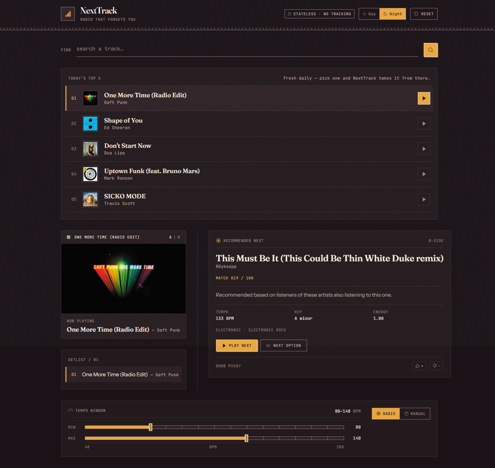
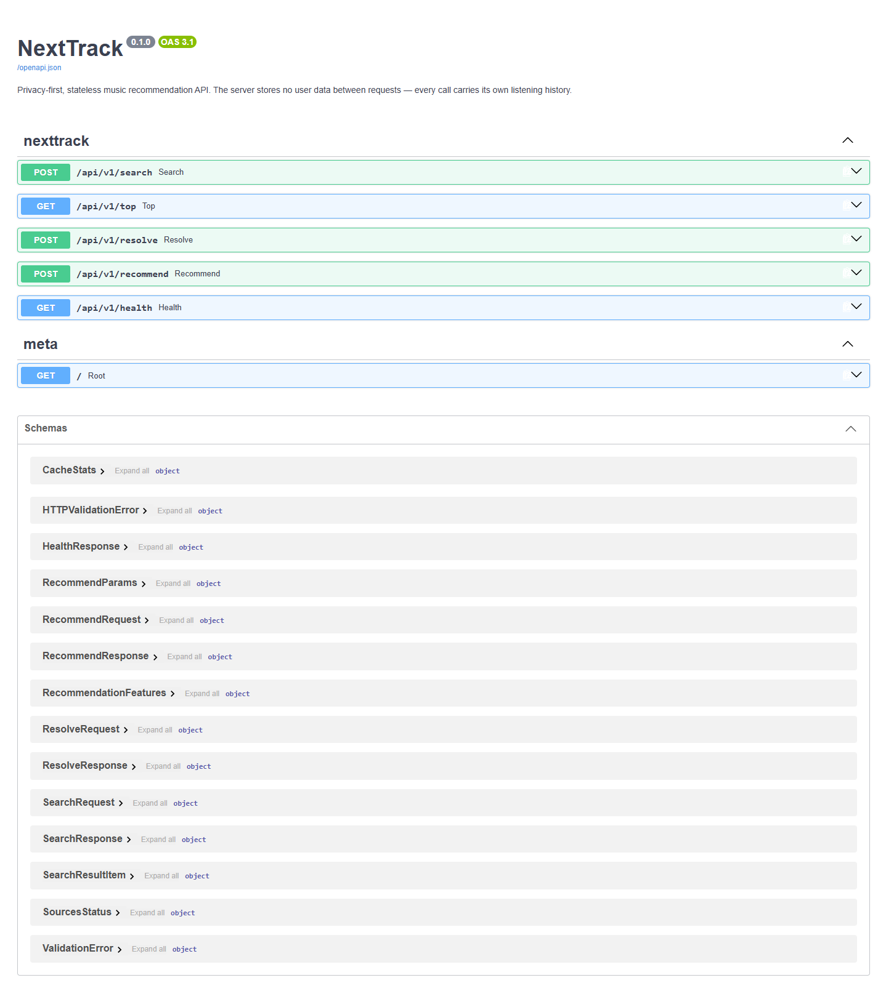
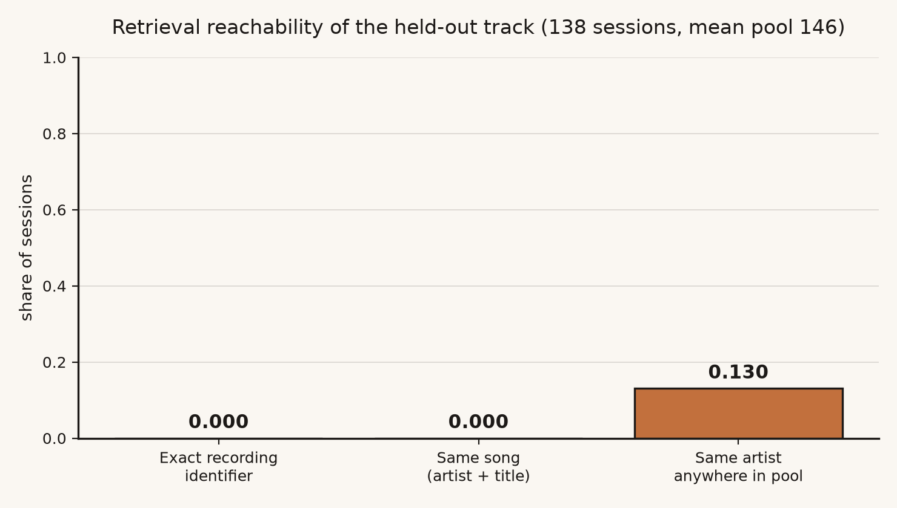
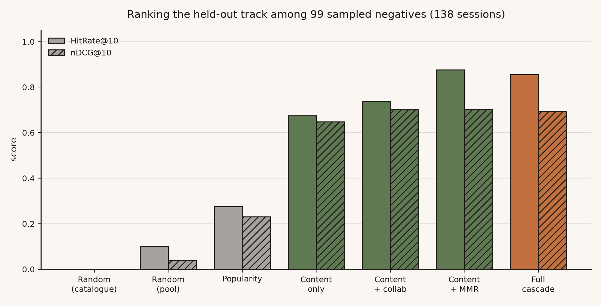
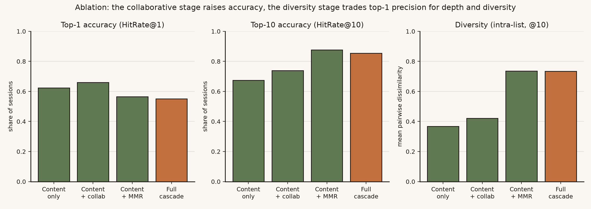
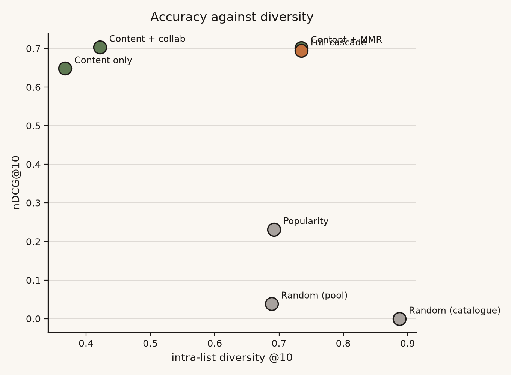
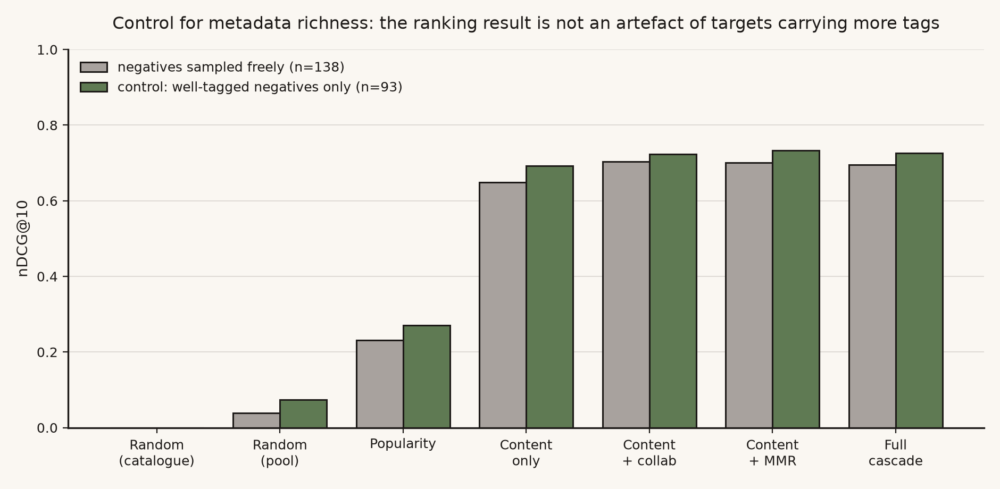
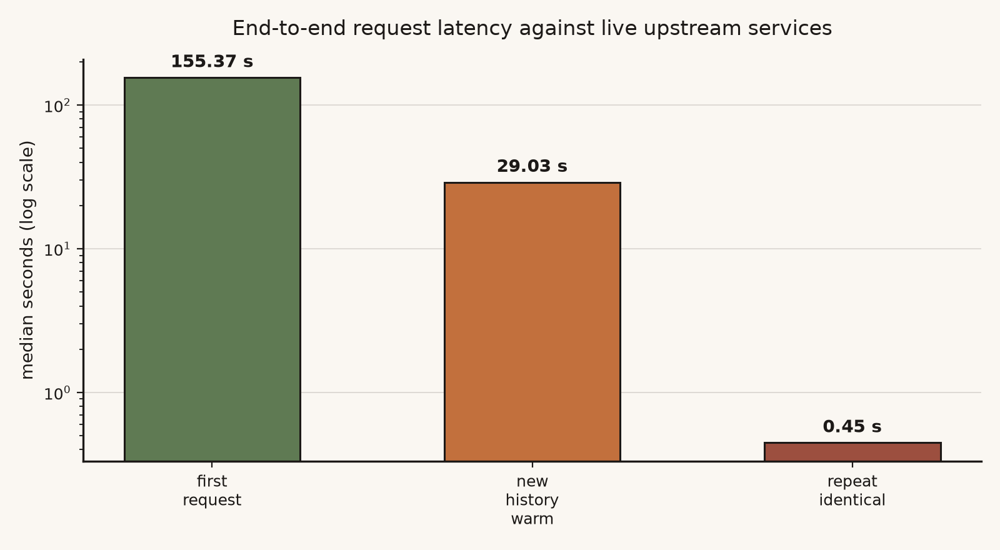

# NextTrack — A Stateless Music Recommendation API

**CM3070 Final Year Project — Final Project Report**
University of London International Programmes · BSc Computer Science and Related Subjects

**Project template:** 7.2 Project Idea 2 — *NextTrack: A music recommendation API*
**Author:** Soe Ming Wei, Glenn · **Student number:** 230657168
**Supervisor:** Yeo Sze Wee

**Code repository:** https://github.com/glennysmw/NextTrack

---

## Chapter 1: Introduction

### 1.1 Project overview and template

NextTrack is a stateless RESTful music recommendation API with a React demonstration
client, built for Final Year Project **Template 7.2, Project Idea 2: "NextTrack: A
music recommendation API"**. A client sends a short list of recently played track
identifiers and optional preferences in a single HTTP request; the server returns one
recommended next track, a confidence score, and a plain-language reason for the
choice. It then forgets everything. There is no account, no listening profile, and no
user database. Each request carries all the context needed to answer it, so the only
data the server retains between calls is a cache of public, per-track facts that are
identical for every caller.

The project sits at the intersection of Music Information Retrieval, recommender
systems, web API design, and privacy-by-design, and it exists to test one practical
question: **does a music recommender actually need a permanent user profile in order to
return a useful next track?**

The answer is two-sided, and the negative half belongs at the outset rather than in
Chapter 5. On *ranking* the engine succeeds: given a candidate set containing the track
a real listener played next, it places that track far above chance or popularity. On
*retrieval* it fails outright — the production candidate generator never once surfaced
the held-out track across 138 evaluated sessions, so end-to-end accuracy is zero for
every configuration and baseline alike. Every accuracy figure below should be read
against that boundary.

### 1.2 Motivation

Recommendation now mediates most music discovery, and recommendation quality drives
listening time and retention (IFPI, 2023). Nearly every commercial system rests on one
premise: the more a platform observes, the better it recommends. That premise creates
three problems this project responds to.

The first is cumulative privacy loss. Every play, skip, and search feeds a long-lived
profile the listener can neither fully inspect nor control, and the resulting store is a
standing liability — Yuan et al. (2023) show that even privacy-preserving collaborative
architectures remain vulnerable to membership inference, because the risk follows the
retained data rather than the storage technique.

The second is profile contamination. A shared or household account blends several
listeners into one profile that fits none of them, with no way to tell whose taste is
being modelled.

The third is developer accessibility. A developer who wants "what should play next" must
adopt an entire platform ecosystem: OAuth, account scopes, per-user state, and quota. No
small, self-contained endpoint answers the question from context alone.

Statelessness addresses all three at once, and it is a testable technical claim rather
than merely a privacy posture. Whitman and Lawrence (2002) identified similar artists
correctly 78% of the time from unstructured community text with no per-user state,
suggesting the signal a reasonable next track needs may already sit in public metadata
and the session itself.

### 1.3 Project aim

To design, build, and critically evaluate a stateless music recommendation API that
produces explained next-track recommendations from session context alone — combining
content-based similarity, aggregate collaborative evidence and explicit diversity
control — and to measure honestly how far that constraint can be pushed.

### 1.4 Objectives and deliverables

The eight objectives established in the preliminary report are carried forward
unchanged, so progress remains comparable across submissions. Section 6.1 tabulates
their final status; each is argued in Chapter 5.

**Objective 1 — Literature review.** Recommender systems, Music Information Retrieval,
REST, privacy-by-design, and recommender evaluation. *Delivered* (Chapter 2).

**Objective 2 — Critical evaluation of prior work.** Spotify, Last.fm, Whitman and
Lawrence (2002) and hybrid recommender research, with NextTrack located against their
limits. *Delivered*, now argued from measured results rather than expectation.

**Objective 3 — RESTful API.** A FastAPI backend documented through OpenAPI.
*Delivered*: five live endpoints with a machine-readable failure contract (Chapters 3
and 4).

**Objective 4 — Recommendation engine.** Content-based filtering, aggregate
collaborative signals and diversity re-ranking. *Delivered in full*: the draft had only
the content stage; both others were built for this submission and each is independently
ablatable (Chapters 3–5).

**Objective 5 — Web front-end.** A React single-page application with search, playback,
history, recommendation display, preferences and local session storage. *Delivered*,
with two defects fixed and a test suite added (Chapter 4).

**Objective 6 — Offline evaluation.** Ranking metrics against baselines plus an
ablation across engine configurations. *Delivered*, against held-out sequences from real
public listening histories (Chapter 5).

**Objective 7 — User study.** A study with at least twelve participants. **Not
delivered.** At the draft stage the engine was a single content-based stage, so
Objective 4 was the larger outstanding deliverable; building and validating the
collaborative stage, the diversity stage, the ablation and the evaluation harness
consumed the time the study needed. Running a study against an engine still changing
weekly would have measured a system that no longer existed at submission. The protocol
is complete (Section 6.5); only its execution is outstanding. Sections 5.8 and 6.1 state
what the absence costs.

**Objective 8 — Final report.** Delivered as this document.

### 1.5 Scope and justification

The objectives form a build path in which each stage makes the next assessable.
Objectives 1 and 2 establish why a stateless design is defensible rather than merely
convenient. Objectives 3 and 4 are the technical core. Objective 5 exists so the system
can be exercised by someone other than the developer — without a usable interface, any
study would measure API literacy rather than listening experience. Objectives 6 and 7
provide the two complementary views of quality Shani and Gunawardana (2011) argue are
both necessary: measurement against data, and response from people.

The asymmetry between those last two is the work's principal limitation. The evaluation
was widened to carry as much evidential weight as it legitimately can — real listening
sessions rather than curated ones, a full ablation, baselines drawn from the same
candidate pools, and a retrieval/ranking decomposition — but no offline measurement
establishes whether a listener *likes* what the system chose.

Two things were out of scope: neural session models, rejected on replicability grounds
(Petrov and Macdonald, 2022; Section 2.6), and persistent server-side infrastructure,
excluded by the project's premise rather than by time.

## Chapter 2: Literature Review

### 2.1 Scope and approach

This review covers seven areas bearing on a stateless music recommender: commercial
systems, content-based filtering, collaborative filtering and hybrids, session-based
recommendation, Music Information Retrieval, privacy-oriented API design, and recommender
evaluation. It draws mainly on work from 2017–2024, reaching back to foundational papers
where a technique's origin matters more than its recency.

Because NextTrack implements the full cascade this literature recommends and has been
measured against real listening sessions, several of these sources can be assessed
against evidence rather than accepted on authority. Where that happens the review says
which prediction held and which did not, and points to the section that measured it.

### 2.2 Spotify: the profile-centric baseline

Spotify is the natural commercial comparison. Eriksson et al. (2019) provide the most
detailed public account of its recommendation stack — a combination of collaborative
filtering over user–track interaction data, text analysis of web and editorial sources,
and audio features for tracks with thin interaction histories. The account is
second-hand and the book's purpose is critical media research rather than system
description, so it is cited here for the architecture's shape rather than its internals.
Surveys by Roy and Dutta (2022) and Li et al. (2024) confirm such hybrids remain the
dominant design.

The privacy problem is structural rather than incidental: collaborative filtering
requires a user–item interaction matrix, which requires persistent per-user data.
Recommendation quality and data retention are not separable features; one is the
mechanism of the other. NextTrack keeps Spotify's central insight — that combining
independent kinds of evidence beats any single signal — while rejecting the premise that
the collaborative half must be personal.

### 2.3 Last.fm, Audioscrobbler, and the substitution this project made

Last.fm built recommendation on scrobbling: recording plays across connected apps and
deriving a co-listening graph (Lamere and Celma, 2007). Schedl et al. (2014) describe
its tag vocabulary as among the strongest public music taxonomies. The preliminary
design named Last.fm as the source of NextTrack's aggregate collaborative stage,
precisely because *aggregate* co-listening can be consumed without the consumer storing
anything about its own users.

That requirement was delivered, but through **ListenBrainz** rather than Last.fm — a
design decision rather than a convenience. Last.fm requires a registered developer key,
breaking the project's "clone and run with no credentials" property, and is keyed on
artist and track *name strings*, which would have demanded a second, lossy name-matching
layer on top of the two-identifier resolution problem the project already contends with
(Section 3.4). ListenBrainz publishes population-level artist similarity keyed natively
on MusicBrainz identifiers, openly and without a key. The literature's argument — that
aggregate co-listening carries similarity information metadata cannot — is what
mattered; Last.fm was one possible supplier of it.

Lamere and Celma's limitation still applies and was observed directly: co-listening
evidence is a function of listener volume, so it is strong for popular artists and absent
for the long tail. ListenBrainz returned similarity data for the large majority of
artists in this project's corpus (Section 5.3) — a figure reflecting a corpus drawn from
what people actually play, which would fall sharply on a uniformly sampled catalogue.

### 2.4 Content-based filtering, and its predicted weakness

Content-based filtering recommends items whose attributes resemble those already chosen
(Lops et al., 2011). For music those attributes are tempo, key, mode, energy, loudness
and genre tags; tracks become feature vectors compared by cosine similarity. The method
suits a stateless recommender exactly because a single request supplies sufficient
context.

Whitman and Lawrence (2002) remain the strongest support for that choice: term profiles
built from unstructured web text identified similar artists correctly 78% of the time
using single-word term sets, with no per-user state.

Two qualifications matter. First, this is *artist* similarity — weaker support for a
track-level content engine than it appears, though unusually direct support for the
artist-level collaborative stage in Section 2.5. Second, the study predates
streaming-scale catalogues and current tagging ecosystems, so its magnitude should not
be transferred. What transfers is the qualitative claim that public metadata alone
carries usable similarity signal. Section 5.5 finds that claim holds for *ranking* —
where the target is present in the candidate set — and Section 5.4 finds it says nothing
about whether retrieval can put the target there.

Lops et al. also identify over-specialisation: ranking by similarity to what a listener
already likes narrows recommendations toward a safe region of the feature space. The
draft report observed this behaviour and could only report it; this submission tests
it. The measurement is more interesting than the prediction. The diversity re-ranking
stage does raise intra-list diversity as expected, but it costs accuracy when applied
alone and recovers that accuracy only in combination with the collaborative stage
(Section 5.5). The literature correctly identified the problem; it does not follow that
the standard remedy is free.

Deldjoo, Schedl and Knees (2024) show content-driven methods remain important in modern
systems, particularly for cold start, privacy constraints, and explainability — all three
of which describe NextTrack's situation. Afchar et al. (2022) connect explainability to
user trust, motivating the requirement that every response carry a plain-language reason.
That requirement had a defect throughout the draft period: one of its four signals could
never fire (Section 4.6), a reminder that a claim about explainability is a claim about
running code.

### 2.5 Collaborative filtering and hybrids: the tension this project had to resolve

Koren, Bell and Volinsky (2009) established matrix factorisation as the workhorse of
large-scale collaborative recommendation. It is unavailable to NextTrack by construction:
latent factors are learned from a persistent user–item matrix. The underlying insight
survives the constraint, though — two tracks heard by overlapping audiences are often
related even when their acoustic and tag descriptions diverge, a relationship content
features are structurally unable to represent.

Burke's (2002) hybrid taxonomy supplies the resolution. In a *cascade* hybrid one method
generates candidates and another re-ranks them, and the re-ranking method need not share
the first's data requirements. Çano and Morisio (2017) confirm in a systematic review
that combined methods usually outperform single-method systems.

The tension the cascade resolves is worth stating plainly, because the literature does
not state it. Aggregate co-listening is consumable without any per-user storage: the
aggregation happens on the provider's side, and the consumer transmits only an artist
identifier. Collaborative *evidence* and collaborative *surveillance* are therefore
separable, contrary to what the Spotify architecture implies — a claim Section 5.5
tests.

### 2.6 Session-based recommendation

Session-based recommendation predicts the next item from current-session behaviour
rather than a long-term profile, which makes it the closest research framing to
NextTrack's problem. Hidasi et al. (2016) introduced GRU4Rec, Kang and McAuley (2018)
SASRec, and Sun et al. (2019) BERT4Rec; all three model the current sequence rather
than a stored profile.

The music-specific form of this problem is automatic playlist continuation, and two
sources bear directly on NextTrack's design. Bonnin and Jannach (2014) survey automated
playlist generation and report a result this project should have taken more seriously at
the design stage: simple popularity- and co-occurrence-based methods are strikingly hard
to beat, and elaborate models frequently fail to justify their complexity. That finding
is the reason *Most popular* is included as the strongest baseline in Section 5.3 rather
than a token floor. The RecSys Challenge 2018 (Chen et al., 2018) then established
playlist continuation at scale as a shared task, and its retrospective makes clear that
candidate *generation* — not ranking — is where most systems win or lose, which is
precisely where Section 5.4 locates this project's failure. Schedl et al. (2018) survey
the open challenges in music recommender research and identify evaluation beyond
accuracy, cold start, and the gap between offline proxies and listener satisfaction as
the field's persistent difficulties; all three describe this project's position
exactly.

This project borrows the field's *problem definition* and its *evaluation protocol*
without adopting its architectures: the evaluation segments listening histories on a
30-minute inactivity gap and holds out the final track — the standard protocol here —
and applies it to a non-neural engine. The architectures were rejected on the grounds
Petrov and Macdonald (2022) document: their replicability study found BERT4Rec's
published results sensitive to training-loss implementation details, a poor foundation
for a project whose central claim must be defensible rather than merely competitive. A
simpler pipeline also preserves what the neural models cannot offer — NextTrack can
state which signal produced each recommendation, which is both a user-facing feature
(Section 2.4) and what made the ablation in Section 5.5 interpretable.

### 2.7 Music Information Retrieval, and infrastructure as a research risk

Bogdanov et al. (2013) introduced ESSENTIA, the analysis library behind AcousticBrainz,
which offered pre-computed descriptors — BPM, key, mode, loudness — for a large corpus.
The preliminary design treated this as a solved dependency: acoustic features would be
looked up rather than computed.

This turned out to be the review's weakest prediction, and the reason is instructive.
AcousticBrainz stopped accepting submissions in 2022, so its coverage is frozen and
sparse relative to any current catalogue. The measured consequence is a sharp split
(Section 5.3): the tracks real listeners actually played are far better covered than the
candidate recordings retrieved by genre search. The engine therefore has genuine acoustic
detail for the *history* far more often than for the *candidates* it must rank, which
undercuts the acoustic dimensions precisely where they would do the most work. Schedl et
al. (2021) argue metadata and acoustic features are complementary; here the genre TF-IDF
block carries most of the ranking load because its partner is frequently absent.

The broader point is one the MIR literature does not usually make: dependence on
centrally-hosted "free" research infrastructure is a longitudinal risk no code review
surfaces. It appeared twice in this project — AcousticBrainz's decommissioning, and the
YouTube Data API quota that forced the move to `ytmusicapi` — and a third time in a
subtler form, discussed next.

### 2.8 Privacy, REST, and the limits of statelessness

Cavoukian (2009) frames privacy-by-design as building privacy in from the outset, and
GDPR Article 5(1)(c) establishes data minimisation as a legal principle (European
Parliament, 2016). Yuan et al. (2023) sharpen why this matters technically: even
federated collaborative filtering remains exposed to interaction-level membership
inference. Their finding supports a stronger position than the one they take — if
privacy-preserving *storage* still leaks, the robust response is not to retain the data
at all. Section 5.7 audits whether NextTrack's implementation honours that.

Fielding (2000) defines statelessness as the REST constraint that each request contain
everything needed to process it. The alignment with the privacy goal is close enough to
look like a coincidence worth interrogating, and this project found the seam. REST
statelessness constrains what the *server* remembers about a *client*; it says nothing
about what the server caches about the *world*. NextTrack caches public per-track
facts — and must, since three rate-limited upstreams otherwise make the system unusable
(Section 5.6). Those caches are shared across callers, so one listener's request can
make a later listener's request faster. That is not a user profile, but it is a real
property, and Section 5.7 reports it rather than hiding behind the word "stateless".

Statelessness also carried an unstated obligation: if a server holds no state, identical
requests ought to yield identical answers, and that reproducibility is much of what a
stateless contract is worth to a developer. It did not hold, for a reason outside the
code (Sections 4.7 and 5.6). Haro Peralta (2023) describes how FastAPI and OpenAPI
support typed, self-documenting APIs — the toolchain NextTrack uses for validation,
documentation and asynchronous request handling.

### 2.9 Evaluation methodology

Shani and Gunawardana (2011) divide recommender evaluation into offline testing and
user studies, and argue that algorithmic accuracy alone does not establish user value.
Celma and Herrera (2008) and Kaminskas and Bridge (2016) show that music recommendation
in particular needs beyond-accuracy measures — diversity, novelty, catalogue coverage —
because listeners value material that is new yet still relevant. Bauer, Zangerle and
Said (2024) warn against over-reliance on a narrow set of benchmark datasets.

Two of these shaped the evaluation directly. Kaminskas and Bridge's argument is why
Section 5.5 reports intra-list diversity, novelty and coverage alongside accuracy, and why
the ablation is read as a trade-off rather than a ranking. Bauer et al.'s warning is why
the held-out data comes from real public ListenBrainz listening histories rather than a
standard benchmark or a curated pool: sequences built by the developer from a
genre-organised seed list would have been circular (Section 5.2).

Shani and Gunawardana's division is also where this evaluation falls short, in exactly
the way their argument anticipates. The offline half was delivered; the user study was
not. Their claim — that offline accuracy does not establish user value — is not something
this report can test, and Section 5.8 treats that as the principal threat to the validity
of everything else reported here.

### 2.10 Synthesis

Three requirements emerge, and this submission can report on all three rather than only
the first.

**A content-based core**, because it functions without stored user data (Whitman and
Lawrence, 2002; Deldjoo et al., 2024; Schedl et al., 2021). Delivered, and measurably
better than every baseline *at ranking, when the target is present in the candidate
set* — a qualifier Section 5.4 makes non-negotiable. It is also weakened by the
acoustic-coverage gap in Section 2.7 more than the literature would predict.

**A hybrid pipeline**, because no single signal covers every listening context and pure
content ranking over-specialises (Lops et al., 2011; Burke, 2002; Koren et al., 2009;
Çano and Morisio, 2017). Delivered as a three-stage cascade, with each stage's
contribution measured separately in Section 5.5.

**Evaluation across both data and people** (Shani and Gunawardana, 2011; Celma and
Herrera, 2008; Kaminskas and Bridge, 2016; Bauer et al., 2024). Delivered on the data
side, including beyond-accuracy metrics and an ablation; not delivered on the human side.
The gap between the literature's standard and this project's evidence is now narrower
than at the draft stage, and precisely locatable, which is the most this report can
honestly claim.

## Chapter 3: Design

### 3.1 Domain, users, and requirements

NextTrack sits in music technology, combining recommendation, RESTful API design, and
privacy-focused system design — a domain characterised by very large catalogues,
irreducibly subjective taste, and evaluation conventions established by ISMIR and ACM
RecSys.

Four user groups shape the design. *Privacy-conscious listeners*, the primary target,
want recommendations without a permanent profile. *Application developers* want a
lightweight endpoint without account-management overhead, which shapes the API contract:
self-contained requests, typed schemas, machine-readable failures. *Shared-account
households* want recommendations reflecting whoever is listening now rather than a
blended history — a case statelessness handles for free, since there is no accumulated
profile to contaminate. *Academic users* want an inspectable system, which is why every
recommendation carries its reasoning and the evaluation is reproducible from the repository.

The requirements these imply are, in priority order: (R1) the server retains nothing
about a user between requests; (R2) a single request carries everything needed to
answer it; (R3) every recommendation is explained in plain language; (R4) identical
requests produce identical responses; (R5) failure of any single upstream degrades the
result rather than the service; (R6) the system runs with no credentials. R4 was
promoted to a first-class requirement during this submission after it was found not to
hold (Section 4.7) — a stateless contract that drifts between calls offers a developer
much less than it appears to.

### 3.2 Design justification

The stateless architecture has two independent supports. The privacy argument follows
Cavoukian (2009) and GDPR data minimisation: data never collected cannot leak, be
subpoenaed, or be inferred from (Yuan et al., 2023). The technical argument follows
Whitman and Lawrence (2002) and Deldjoo et al. (2024): metadata-driven similarity
carries enough signal to be useful without per-user state.

The recommendation design is a **cascade hybrid** in Burke's (2002) sense: content-based
candidate generation, aggregate collaborative re-ranking, and diversity
post-processing. The cascade form is what makes the privacy constraint survivable. In a
*weighted* or *feature-combination* hybrid the collaborative component would need
per-user vectors; in a cascade, each stage only re-orders what the previous stage
produced, so a stage may draw on population-level evidence without the system holding
any individual's data.

All three stages are implemented, and the design below describes what runs rather than
what was intended; Section 3.7 lists what changed and why.

### 3.3 System architecture

The system has four layers (Figure 1): presentation, API, recommendation engine, and
data/cache. The separation earned its keep — the collaborative and diversity stages were
added without touching the API or presentation layers, and the evaluation harness reuses
the engine layer directly by substituting the data layer beneath it.

**Figure 1. NextTrack's four-layer architecture.** All components shown are implemented and tested. The dashed Last.fm client from the preliminary design has been replaced by the ListenBrainz client, for the reasons in Section 2.3.

```
┌──────────────────────────────────────────────────────────────────┐
│ PRESENTATION   React 18 + TypeScript SPA                         │
│   search · Today's Top 5 · player · setlist · recommendation     │
│   card · preferences · feedback · privacy badge · theme          │
│   state: localStorage only (history, current track, prefs)       │
└───────────────────────────────┬──────────────────────────────────┘
                                │ HTTPS, self-contained requests
┌───────────────────────────────▼──────────────────────────────────┐
│ API            FastAPI + Pydantic v2 (extra="forbid")            │
│   POST /search   GET /top   POST /resolve                        │
│   POST /recommend   GET /health          → OpenAPI at /docs      │
└───────────────────────────────┬──────────────────────────────────┘
┌───────────────────────────────▼──────────────────────────────────┐
│ ENGINE         cascade hybrid, computed fresh per request        │
│   1 content      features.py + similarity.py  (cosine/centroid)  │
│   2 collaborative  collaborative.py           (LB affinity)      │
│   3 diversity      diversity.py               (MMR vs history)   │
│                    rationale.py               (explanation)      │
└───────────────────────────────┬──────────────────────────────────┘
┌───────────────────────────────▼──────────────────────────────────┐
│ DATA / CACHE   MusicBrainz · AcousticBrainz · ListenBrainz ·     │
│                YouTube Music                                     │
│   in-memory caches keyed on public identifiers only:             │
│   features[mbid] · youtube[mbid] · candidates[genre] ·           │
│   artist_tags[artist] · similar_artists[artist]                  │
└──────────────────────────────────────────────────────────────────┘
```

The **presentation layer** is a React 18 and TypeScript single-page application. The
browser holds session history, the current track, preferences, feedback, and the
day/night theme in `localStorage`; the server receives history only when `/recommend`
is called, and only for the duration of that call.

The **API layer** exposes five endpoints. Pydantic v2 validates every request with
`extra="forbid"`, so an unrecognised field is rejected rather than silently ignored —
a deliberate choice for an API meant to be integrated against, since silent acceptance
of a misspelled parameter is a debugging trap.

The **engine layer** runs the three cascade stages within a single request, with no
persisted model and no training step. Nothing it computes outlives the response.

The **data layer** integrates four upstream services and holds the caches. Every cache
key is a public identifier — an MBID, an artist MBID, or a genre tag — so cached values
are facts about the world rather than facts about a caller (Section 5.7).

### 3.4 The two-identifier resolution model

Moving search to YouTube Music introduced a design problem the preliminary report did
not anticipate. Search results and Today's Top 5 carry a *YouTube video id*, but the
engine needs a *MusicBrainz id* to look up genre, acoustic, and collaborative data.

NextTrack resolves this with a lazy two-identifier model (Figure 2). A search result
plays immediately from its YouTube id; only when the user actually plays it does the
client call `POST /resolve`, which issues a fielded MusicBrainz query
(`recording:"…" AND artist:"…"`) to pin the official recording rather than accept a
free-text match. The resolved MBID replaces the YouTube id in that history entry.
Entries that fail to resolve still play but are excluded from the next `/recommend`
call, since only a valid MBID can seed one. A recommendation response already carries
its own MBID, so continuing to listen never triggers another resolve — only the entry
point does.

**Figure 2. The two-identifier resolution flow.**

```
  search / Top 5 ──► YouTube video id ──► plays immediately
                            │
                     user presses play
                            │
                            ▼
                   POST /resolve {title, artist}
                            │
              fielded MusicBrainz query pins the
              official recording (not a cover)
                            │
              ┌─────────────┴──────────────┐
              ▼                            ▼
        MBID found                   no match
   replaces the YouTube id      still plays; excluded
   in the history entry         from /recommend seeding
              │
              ▼
        POST /recommend ──► response already carries an MBID,
                            so the loop needs no further resolve
```

The design is deliberately lazy rather than eager: resolving every search result up
front would spend a rate-limited MusicBrainz request per result for tracks the user will
never play, which at 1 req/sec is the difference between a search returning in under a
second and one taking ten.

### 3.5 The recommendation pipeline

**Stage 1 — content.** Each track becomes a vector: 16 fixed acoustic dimensions
(tempo normalised over 40–200 BPM, a 12-dimension one-hot pitch class with enharmonic
flats mapped to sharps, a major/minor flag, clamped energy and loudness) concatenated
with a sparse genre TF-IDF block. The history vectors are averaged into a session
centroid, and candidates are ranked by cosine similarity to it.

The genre vocabulary is **rebuilt per request**, scoped to the genres present in that
request's history and candidates. This is a direct consequence of R1 rather than an
oversight: a persistent global vocabulary would be shared mutable server state through
which one request could, however faintly, influence another's feature space. The cost
is that vector dimensionality varies between requests; the benefit is that every
recommendation is reproducible from its own inputs alone.

**Stage 2 — aggregate collaborative.** Each history track's artist MBID is sent to
ListenBrainz, which returns artists that the ListenBrainz population co-listens with
that artist. Scores from different reference artists are raw co-occurrence counts whose
magnitude depends on the reference artist's popularity, so each list is normalised
against its own maximum before merging, and an artist matching several history artists
takes the strongest normalised score rather than the sum — which keeps affinity bounded
in [0, 1] and prevents a broadly popular artist accumulating an unbounded advantage.

The blend is `(1 − w)·content + w·collaborative` with `w = 0.3`, applied **only where
collaborative evidence exists**. With no evidence the content score passes through
unchanged. The alternative — always applying the blend — would scale every unmatched
candidate by `(1 − w)`, a uniform rescaling that changes nothing about relative order
but deflates the confidence score shown to the user. Given partial ListenBrainz
coverage, that would have made most scores quietly meaningless.

**Stage 3 — diversity.** Maximal Marginal Relevance (Carbonell and Goldstein, 1998)
greedily selects by `λ·rel(c) − (1 − λ)·max_{s∈S} sim(c, s)`, with `λ = 0.7`. The
design decision here is what goes into `S`. Classical MMR starts with `S` empty; but a
next-track recommender emits one item, so an empty `S` reduces MMR to plain relevance
ranking and changes nothing. NextTrack therefore **seeds `S` with the listening
history**, which makes the redundancy term measure how close a candidate is to music
the listener has just heard — precisely the over-specialisation Lops et al. (2011)
predict. `λ = 1` recovers pure relevance ranking, which is how the ablation in
Section 5.5 disables the stage without a separate code path.

### 3.6 Design decisions and alternatives considered

**Cascade over weighted hybrid.** A weighted hybrid would let the collaborative signal
contribute everywhere rather than only as a re-rank, but needs per-user vectors to weight
against. The cascade preserves R1.

**ListenBrainz over Last.fm** (Section 2.3): the requirement was aggregate collaborative
evidence, not a particular vendor.

**Artist-level over track-level collaborative similarity.** Track-level similarity was
implemented and tested first and returned empty results for most seeds in this catalogue;
artist-level resolves for essentially any charting artist and captures the same
cross-genre audience overlap — a decision made on measurement, not preference.

**Caching the candidate pool.** The preliminary design had no candidate cache. It was
added after measurement showed MusicBrainz's tag search returns a different result set
on every call, which broke R4 (Sections 4.7, 5.6). The alternative — accepting
non-determinism — was rejected because reproducibility is a substantial part of what a
stateless API offers.

**Bulk acoustic fetching.** Resolving ~50 candidates individually meant roughly a
hundred concurrent requests to a single decommissioned host and dominated cold-request
latency. AcousticBrainz's bulk endpoints reduce this to four requests.

**Rejecting Redis.** Marked in the code as deferred, and left deferred. The in-memory
caches deliver the latency and determinism benefits Redis was wanted for within one
process; a distributed cache is a scaling concern, not a correctness one, and adding it
would have introduced a persistent store into a project whose premise is not having one.

### 3.7 Changes since the draft design

Four substantive changes, all driven by evidence rather than preference:

1. **Stages 2 and 3 built.** The draft marked both as planned. Both now run, and each
   is independently ablatable through a `PipelineConfig` the API never varies and the
   evaluation harness does.
2. **A fourth upstream source.** ListenBrainz joins MusicBrainz, AcousticBrainz and
   YouTube Music, and is reported on `/health` alongside them.
3. **Candidate-pool caching**, promoted from an optimisation to a correctness
   mechanism once R4 was found to be violated.
4. **Bulk acoustic retrieval**, replacing per-candidate fetching.

The engine described here is the engine that runs. Where the design and the
implementation differ in any respect, Chapter 4 says so.

## Chapter 4: Implementation

### 4.1 Technology choices

The backend is Python 3.12 with FastAPI, uvicorn, Pydantic v2, NumPy, scikit-learn,
httpx, `musicbrainzngs`, `ytmusicapi`, and `python-dotenv`. FastAPI was chosen for three
properties this project needs together: validation from type annotations, OpenAPI
documentation generated from those same annotations (satisfying Objective 3 without a
parallel spec to keep in sync), and native async handling, which matters because a single
recommendation fans out to four independent external services.

`musicbrainzngs` and `ytmusicapi` are both synchronous, so every call into them is
wrapped in `asyncio.to_thread`; AcousticBrainz and ListenBrainz are reached through
async `httpx` directly. This mixed model is the reason the concurrency work in
Section 4.5 was necessary.

The frontend is React 18, TypeScript, Vite, Tailwind CSS, `react-youtube`, and
`lucide-react`, with a deliberately non-generic visual identity (Section 4.9).

### 4.2 The request pipeline

`POST /recommend` executes the steps in Figure 3, none of which reads or writes state
that outlives the request.

**Figure 3. The seven-step pipeline inside a single `POST /recommend`.**

```
1  resolve history        asyncio.gather over MBIDs → MusicBrainz + AcousticBrainz
                          (cache hit skips both)
2  select search genres   three most common history genres, ties by first appearance
3  retrieve candidates    per-genre pool from cache, else MusicBrainz tag search
4  filter                 history · excluded artists · excluded tracks · tempo window
5  resolve candidates     ONE bulk AcousticBrainz call per 25 candidates
6  collaborative affinity ListenBrainz artist similarity for the history's artists
─────────────────────── await-free boundary ───────────────────────
7  rank                   vocabulary → vectors → centroid → cosine
                          → collaborative blend → MMR re-rank
8  resolve playback       YouTube Music, falling through on misses
9  explain                rationale sentence from the signals that matched
```

The horizontal rule is load-bearing and is discussed in Section 4.5.

### 4.3 Feature vectors and the request-scoped vocabulary

`features.build_feature_vector` concatenates the 16 fixed acoustic dimensions with a
genre TF-IDF block. The weighting uses the standard smoothed form,
`idf(g) = ln((1 + N) / (1 + df(g))) + 1`, so a genre appearing on most observed tracks
("rock", "pop") contributes less than one appearing on few ("shoegaze", "math rock") —
Whitman and Lawrence's (2002) metadata-similarity intuition applied at tag level rather
than free-text level. The vocabulary is module-level mutable state, which is what makes
vectors within a request comparable, and what made request isolation a genuine
engineering problem (Section 4.5).

`similarity.cosine_score` clamps to [0, 1] and returns 0 for a zero vector rather than
propagating scikit-learn's undefined-cosine behaviour — a candidate with no genre tags and
default acoustics can legitimately produce one.

### 4.4 The collaborative stage

The interesting part of `collaborative.py` is not the lookup but the score arithmetic,
because ListenBrainz returns raw co-occurrence counts rather than normalised
similarities:

```python
def build_affinity(similar_by_artist: dict[str, dict[str, float]]) -> dict[str, float]:
    affinity: dict[str, float] = {}
    for similar in similar_by_artist.values():
        if not similar:
            continue
        peak = max(similar.values())          # per-reference-artist normalisation
        if peak <= 0:
            continue
        for mbid, score in similar.items():
            normalised = score / peak
            if normalised > affinity.get(mbid, 0.0):   # max, not sum
                affinity[mbid] = normalised
    return affinity
```

Two decisions are encoded here. Normalising per reference artist is necessary because
a count of 900 against Queen and a count of 20 against an obscure artist represent
comparable strengths of association; comparing them raw would let popularity dominate.
Taking the maximum rather than the sum keeps affinity bounded in [0, 1], so an artist
similar to every track in a five-track history cannot accumulate a score that swamps
the content signal.

The blend then applies only where evidence exists:

```python
def blend(content_score: float, collab_score: float, weight: float) -> float:
    if collab_score <= 0.0:
        return content_score          # no evidence must not deflate the score
    return (1.0 - weight) * content_score + weight * collab_score
```

This is the difference between a confidence score that means something and one that is
uniformly depressed by the coverage of a third-party service.

Every failure mode of the ListenBrainz client — unknown artist, HTTP error, malformed
payload, connection failure, timeout — returns an empty dict, which the pipeline reads
as "no collaborative evidence". A failure is deliberately *not* cached, so a transient
outage does not poison an artist's entry for the rest of the process's life. Fifteen
tests cover the client, most of them failure paths.

### 4.5 Request isolation under concurrency

The genre vocabulary is a process-global singleton. If one request's
reset-observe-build sequence interleaved with another's on the event loop, genres from
one listener's session could enter another's feature vectors — a direct violation of R1
and R4, and a defect that is invisible to inspection and intermittent in testing.

The fix is structural: the whole sequence lives in `recommender._rank`, a synchronous
function containing no `await`, and the event loop cannot switch tasks except at an await
point. Every operation that *does* await — resolving history, retrieving candidates, bulk
acoustics, ListenBrainz affinity — was hoisted above it, which is why step 6 in Figure 3
precedes step 7 even though the collaborative score is consumed only during ranking. The
invariant is stated in the function's docstring so a future edit introducing an `await`
reads as a correctness change rather than a style change, and
`test_recommend_concurrency.py` asserts it both by planting foreign vocabulary before a
request and by gathering two concurrent recommendations.

### 4.6 Explanation generation, and a defect that hid inside it

`rationale.generate_rationale` builds one sentence from whichever signals actually
clear their thresholds: collaborative affinity ≥ 0.15, at least two shared genre tags,
tempo within 10 BPM of the history average, energy within 0.15, or a matching key and
mode. The collaborative signal is named first when present, because it is the only one
sourced from other listeners rather than from the track's own metadata, and a reader
should be able to tell those apart.

This code contained a defect for the entire draft period. The session's most common key
was computed with a `Counter` keyed on `(pitch, mode)` tuples, then unpacked as:

```python
common_pitch, common_mode = key_counts.most_common(1)[0]     # wrong
```

`Counter.most_common` yields `(item, count)` pairs, so `common_pitch` was bound to the
whole `('F#', 'minor')` tuple and `common_mode` to an integer — accepted silently,
because both sides have arity two. The key-match branch therefore compared a string
against a tuple and could *never* be true: the "compatible key" explanation was
unreachable for every recommendation the system had ever produced, and the rendered key
read `"('F#', 'minor') 2"`.

No test caught it, because the rationale tests exercised the genre, tempo and energy
signals but never constructed a candidate matching on key alone. `mypy` did, immediately.
Three regression tests now cover it, including one whose candidate deliberately fails
every threshold except key. A project claiming explainability is claiming something about
running code, and what found this was static analysis rather than more testing of paths
already believed to work.

### 4.7 Reproducibility: a property that did not hold

The draft report stated that identical histories "always produce the same candidate
search". A determinism assertion added to the live API-capture script showed the
end-to-end property was false: the same request twice returned different tracks.

The cause was not in NextTrack. Probing MusicBrainz directly:

```
grunge            run1 == run2: False    |symmetric difference| = 100  (of 50 + 50)
alternative rock  run1 == run2: False    |symmetric difference| = 38
```

Two consecutive tag searches for `grunge` shared **zero** of their fifty results.
Thousands of recordings tie on relevance and the tie order is arbitrary, so the
candidate pool — and therefore the winner — changed between calls. Genre *selection*
was deterministic, exactly as the draft claimed; the search results were not.

The fix has two parts, both necessary. Candidate pools are cached per genre tag with a
one-hour TTL, and each pool is sorted by MBID before storage so no ordering dependence
on the upstream survives. Like the other caches this holds a public per-tag fact and
nothing about a caller.

It also produced the single largest performance improvement in the project, because
three rate-limited MusicBrainz searches were the dominant cost of every recommendation:

| Request | Before | After |
|---|---:|---:|
| `/recommend`, cold | 42.3 s | 24.7 s |
| `/recommend`, multi-track history | 61.5 s | 0.53 s |
| `/recommend`, with constraints | 32.2 s | 0.79 s |

*Table 1. End-to-end latency before and after candidate-pool caching, same three requests against live upstreams. "Cold" = empty candidate-pool cache in a running process with other caches warm, not a cold start; Table 5 reports that case and Section 5.6 reconciles them.*

The honest residual is that determinism now holds for the cache TTL rather than
absolutely: once a pool expires, an identical request may legitimately return a
different track because the upstream catalogue view has changed. That is a property of
MusicBrainz, not something NextTrack can fix, and Section 5.6 reports it as a
limitation.

### 4.8 Acoustic features: bulk retrieval, and a proxy that measured the wrong thing

Resolving a candidate pool meant one AcousticBrainz low-level and one high-level request
per candidate — roughly a hundred concurrent requests to a single largely-decommissioned
host, which measurement identified as the dominant remaining cold-start cost.
AcousticBrainz's bulk endpoints accept up to 25 identifiers per call, reducing this to
four requests. `get_features_bulk` batches, issues both levels concurrently, and returns
an entry for every requested MBID with `None` meaning "no data" — deliberately identical
to what an outage produces, since the caller must handle both the same way.

The more consequential problem was what the acoustic block *contained*. AcousticBrainz
publishes no direct energy descriptor, so the implementation derived one from the
high-level **danceability** classifier, with a `# TODO: verify field name` attached.
Verifying it showed the field name was correct and the *choice of field* was wrong.
Queried live for The Killers' "Mr. Brightside":

| Classifier | Probability |
|---|---:|
| `danceability.danceable` | **0.024** |
| `mood_aggressive.aggressive` | 0.983 |
| `mood_party.party` | 0.863 |
| `mood_relaxed.relaxed` | 0.034 |

*Table 2. High-level AcousticBrainz classifiers for a single track, showing that danceability is close to orthogonal to energy for guitar music.*

Danceability measures whether a track invites dancing, not how energetic it is, so the
value used as "energy" was 0.02 for one of the most energetic tracks in the seed pool.
This propagated three ways: cosine similarity ranked on a near-meaningless coordinate;
the "matching energy level" rationale could fire between tracks with nothing energetic in
common; and the card displayed "ENERGY 0.00" for a rock song, which reads as broken. The
replacement averages `mood_aggressive`, `mood_party` and the complement of `mood_relaxed`
— three classifiers that do bear on energy and agree on the example above — scoring the
same track 0.937.

Because the evaluation corpus stores *parsed* features, this change would have left it
stale, so a `refresh-acoustics` phase re-derives the whole corpus through the bulk
endpoints in seconds and runs as part of the harvest.

### 4.9 Frontend implementation

The React frontend mirrors the backend's care about request correctness.

`useRecommendation` tags every fetch with a monotonically increasing request id and
discards any response whose id is stale. This prevents a slow earlier fetch from
overwriting a newer result when the user double-clicks or radio mode auto-advances
mid-request. Both the success and the failure path are guarded — a stale *rejection*
clearing a newer valid recommendation is the subtler of the two bugs, and is covered by
its own test.

`useLocalStorageState` validates anything read back from `localStorage` against a type
guard, so a stale schema or a hand-edited value hydrates the default rather than reaching
components with the wrong shape.

`playTrack` was hardened during this pass. It awaited `resolveTrack` without error
handling, so a MusicBrainz outage (a 503) rejected the promise and abandoned the rest of
the function: the track played but never entered the setlist, no recommendation was
requested, and the only trace was an unhandled rejection in the console. A failed resolve
is now treated as "unresolved", so playback and history still work.

**Demo mode** (`VITE_DEMO_MODE=true`) swaps every network call for deterministic mock
data, and was broken end to end: mock tracks carried placeholder identifiers like
`mock-0001-teen-spirit`, which fail the `isMbid()` guard, so playing anything from search
or Today's Top 5 produced "we couldn't identify that track" — on precisely the path a
demonstration would take. Mock tracks now carry *real* MusicBrainz identifiers, and the
resolve stub mirrors the live endpoint's contract including its `null` return, so demo
mode exercises the live code path.

The visual design is deliberately not a component-library default. The Tailwind
configuration replaces the framework palette with a named set of custom properties
(paper, sleeve, deck, ink, amber, moss, rust), a restricted type scale, hard 2px borders
and a one-pixel unblurred drop shadow, paired with Fraunces and Instrument Sans, plus a
day/night theme applied as a single class flip on `<html>` before first paint. The
"listening deck" identity reinforces the session-based framing of the product (Figure 4).



**Figure 4.** NextTrack running live: Today's Top 5, the player and setlist, and the Recommended Next card showing a Daft Punk → Röyksopp recommendation whose rationale reads "Recommended based on listeners of these artists also listening to this one." That recommendation crosses a genre boundary the content stage alone would not have crossed, which makes it a visible instance of the collaborative stage doing work.



**Figure 5.** the FastAPI-generated OpenAPI documentation at `/docs`, listing all five endpoints and their schemas.

### 4.10 Testing and quality gates

The backend carries **121 tests** across fourteen files (up from 37 at the draft stage),
and the frontend **29** across three, using Vitest and React Testing Library where it
previously had none.

One property is worth describing because it was a claim before it was a mechanism. The
README and draft report both stated that all external APIs are mocked and no real
network calls are made. That was a convention: nothing enforced it, and the
ListenBrainz health probe was in fact making live requests from the suite. An autouse
fixture now guards the boundary — and needed two layers to do it. A socket-level guard
catches the synchronous clients, but **not** async `httpx`: on Windows the Proactor
event loop connects through overlapped I/O rather than `socket.socket.connect`, so an
unmocked async client passes straight through. That gap was not hypothetical; the
AcousticBrainz bulk client made live requests from the suite until it was found. An
httpx-level guard inspecting the request URL closes it, and `test_network_guard.py`
tests the guard itself so a future gap fails there rather than silently re-enabling
live traffic.

Beyond the suite, a 32-case adversarial sweep (`scripts/adversarial_sweep.py`) throws
hostile input at a running instance — wrong types and arity, 100 KB strings,
injection-shaped identifiers, reversed ranges, unicode, wrong methods — against one rule:
**no malformed request may produce a 5xx**. It found one: a whitespace-padded identifier
passed validation (which strips) but was used unstripped, reached MusicBrainz, retried
eight times, and surfaced as a 503 blaming a working service. Validating one value and
using another is the defect; a `normalise_mbid` step at the boundary fixes it, and the
sweep now passes 32/32.

Static analysis runs clean: `ruff` (with import ordering, bugbear, comprehension,
modernisation and unused-argument rules), `mypy` over all 23 backend source files, and
`tsc --noEmit` over the frontend. `mypy` earned its place by finding the defect in
Section 4.6. The frontend dependency tree was also repaired: Vite 8 was installed
against a plugin declaring support only to Vite 7, leaving `npm ls` reporting an invalid
tree, and `npm audit` reported two high-severity advisories. Both are resolved.

### 4.11 Reproducible evaluation tooling

The evaluation lives in the repository rather than beside it, in four scripts under
`backend/scripts/`: `build_eval_dataset.py` harvests held-out listening sessions in three
resumable, checkpointed phases; `augment_catalogue.py` snapshots real MusicBrainz
candidate-retrieval responses; `offline_eval.py` runs seven arms over the snapshot; and
`make_figures.py` renders every figure from the raw results, so no number in a figure is
typed by hand.

The decision that matters most for validity: `offline_eval.py` calls
`recommender.recommend_ranked` itself, with only the data clients redirected at the
snapshot. An evaluation that re-implements the scoring logic measures the
re-implementation; here the code under measurement is the code that serves requests.

## Chapter 5: Evaluation

### 5.1 Objectives, and what this evaluation cannot establish

The evaluation answers three questions. Can the engine predict a real listener's next
track better than obvious alternatives? Does each cascade stage earn its place? And is
the system correct, reproducible and robust enough to be trusted?

It cannot answer a fourth the original plan treated as central — whether listeners
*like* what NextTrack chooses — because **no user study was conducted** (Objective 7;
reasons in Section 1.4). In partial compensation the offline work was widened: real
listening sessions rather than curated ones, three baselines, beyond-accuracy metrics, a
retrieval/ranking decomposition, paired significance testing with effect sizes, a
metadata control, and a live latency benchmark.

### 5.2 Methodology and its justification

**Protocol.** Each held-out session supplies a listening history and one ground-truth
next track, and all seven arms rank the *same* candidate set for the *same* session, so
differences are attributable to ranking rather than retrieval luck.

**Ground truth from real listening sessions.** Building held-out sequences from the
project's own curated seed pool would have been circular — measuring how well a
genre-driven engine reproduces its author's groupings. The ground truth instead comes
from **real, voluntarily-public ListenBrainz listening histories**, segmented on a
30-minute inactivity gap (Hidasi et al., 2016) with the final track held out. Their
construction knows nothing about genre, tempo or co-listening, so the ground truth is
independent of every signal the engine ranks on — addressing Bauer et al.'s (2024)
warning against convenient benchmark data.

**Realistic distractors.** The evaluation replays **real MusicBrainz tag-search
responses** in MusicBrainz's own order, so the engine faces the production pool, obscure
recordings included.

**The engine evaluates itself, reproducibly** (Section 4.11): the harness calls the
production ranking code with only the data clients redirected at a committed snapshot and
the random baseline seeded, so `scripts/offline_eval.py` reproduces every number here.

### 5.3 Dataset, baselines and metrics

**Dataset.** The harvest produced **140** held-out sessions from 24 listeners, each 4–8
tracks long (median 8), covering 859 recordings by 322 artist *names*, ranked against a
catalogue of 5,844 that includes 4,985 real retrieved candidates. Two reductions apply
throughout: **138 sessions are rankable** (two resolved no history track to a genre, so
produced no pool, and are excluded from every arm rather than scored as misses), and the
322 names resolve to **281 distinct MusicBrainz artist identifiers**, the rest being
collaboration credits and name variants collapsing onto identifiers already counted. Coverage is quoted against the 281, since that is what the collaborative
stage queries: **94.0%** have ListenBrainz similarity data, while **65.8%** of session
tracks have AcousticBrainz data. A median of five genre tags per track (7% carry none)
means the genre block does most of the ranking work.

**Baselines.** *Random (retrieved pool)* isolates ranking by giving chance the same
100-item set every other arm receives. *Most popular* ranks that set by how many corpus
sessions contain each track — the strongest non-personalised baseline, the one Bonnin and
Jannach (2014) warn is harder to beat than it looks. *Random (whole catalogue)* samples
all 5,844 tracks instead, so it does not share the others' protocol and appears in
Table 4 only as a sanity floor.

**Ablation.** Content only; content + collaborative; content + MMR; full cascade.
Disabling a stage sets its parameter to the neutral value (collaborative weight 0, MMR
λ = 1) rather than branching, so the ablation exercises production code.

**Metrics.** HitRate@K and nDCG@K measure accuracy, the latter sensitive to *where* the
track landed, and MRR summarises rank position. Intra-list diversity, novelty and
coverage are the beyond-accuracy measures Celma and Herrera (2008) and Kaminskas and
Bridge (2016) argue music recommendation requires. Reachability is reported separately
because it bounds every accuracy figure above.

**Significance.** Arms score the same sessions, so results are paired and tested with a
Wilcoxon signed-rank test (Wilcoxon, 1945) rather than a t-test, since per-session nDCG
is bounded, heavily tied at zero and not normal. Six pairwise comparisons inflate the
family-wise error rate, so p-values are quoted uncorrected and checked under
Holm–Bonferroni at α = 0.05, which changes no conclusion. Effect sizes are matched-pairs
rank-biserial correlations *r*. Appendix C gives the full table.


### 5.4 Experiment A — the retrieval stage cannot reach the target

The first result reframes everything after it. For each of the 138 rankable sessions the
engine's genre-gated MusicBrainz search ran exactly as in production, producing a mean
pool of 145.7 candidates, checked for the track the listener played next.

| Held-out track present in the retrieved pool? | Share of sessions |
|---|---:|
| Exact recording identifier | **0.000** |
| Same song (normalised artist and title, any release) | **0.000** |
| Same *artist* only, anywhere in the pool | 0.130 |

*Table 3. Retrieval reachability across 138 held-out sessions, mean pool size 145.7.*



**Figure 6.** the same result as a chart: the held-out track is never in the pool by identity or by song, and its artist appears in one pool in eight.

**Not once in 138 sessions did retrieval surface the track the listener played next** —
neither the exact recording nor the same song under another release identifier — and even
the artist appeared in only 13% of pools. End-to-end accuracy is therefore exactly zero
for every arm, baselines included, and no ranking improvement could change it.

The cause is visible in the pools. `search_recordings(tag=…)` returns only recordings
carrying a folksonomy tag — a small, arbitrary, long-tail slice of the catalogue.
Searching `electronic` returns Perky Chap, 2/5 BZ and Nuno Canavarro; the corpus
listeners were playing Röyksopp, Jon Hopkins and Ott. The populations barely intersect,
and widening the pool would only draw more of the same tail.

This contradicts an assumption carried unexamined from the preliminary report onward:
that MusicBrainz tag search is a viable candidate generator. It generates candidates for
*tagged recordings*, a different and much smaller thing. Since end-to-end accuracy is
uniformly zero it cannot discriminate between configurations, so ranking is measured
separately below.

### 5.5 Experiment B — ranking quality, and what each stage contributes

**Protocol, stated plainly because it matters.** The held-out track is **injected** into
a 100-item candidate set — itself plus 99 negatives sampled from the pool the engine
really retrieved — and every arm ranks that same set. This is the sampled-negatives
protocol standard in sequential recommendation (Kang and McAuley, 2018; Sun et al., 2019)
and it measures ranking *given* reachability. It is **not** end-to-end accuracy, which
Section 5.4 reports as zero.

| Arm | HitRate@1 | HitRate@10 | nDCG@10 | MRR | ILD@10 | Coverage |
|---|---:|---:|---:|---:|---:|---:|
| Random (whole catalogue) † | 0.000 | 0.000 | 0.000 | 0.000 | 0.887 | 0.213 |
| Random (retrieved pool) | 0.000 | 0.101 | 0.039 | 0.021 | 0.689 | 0.167 |
| Most popular | 0.188 | 0.275 | 0.231 | 0.217 | 0.692 | 0.077 |
| Content only | **0.623** | 0.674 | 0.648 | **0.640** | 0.367 | 0.150 |
| Content + collaborative | **0.659** | 0.739 | **0.704** | **0.692** | 0.421 | 0.138 |
| Content + MMR | 0.565 | **0.877** | 0.701 | 0.647 | **0.735** | 0.142 |
| Full cascade | 0.551 | 0.855 | 0.695 | 0.644 | 0.735 | 0.135 |

*Table 4. Ranking the held-out track among 99 sampled negatives, 138 sessions. † samples the whole 5,844-track catalogue, not the shared candidate set — a sanity floor, not a comparable arm.*



**Figure 7.** baselines against engine configurations on HitRate@10 and nDCG@10.



**Figure 8.** each stage's contribution across top-1 accuracy, top-10 accuracy and diversity.



**Figure 9.** every arm plotted on the accuracy/diversity plane.

**Against the baselines, the engine wins decisively — within the injected-target
protocol.** The full cascade beats random selection within the same candidate set by
0.656 nDCG (r = 0.98) and popularity by 0.464 (r = 0.89), both p < 0.00001 and surviving
Holm–Bonferroni. Random selection over the whole catalogue scores zero, the expected
1-in-5,844 result, confirming the metrics behave. This supports the project's premise *as
a claim about ranking*: session context alone ranks a listener's actual next track far
above chance and popularity — whenever that track is in the set being ranked, which
Section 5.4 shows production retrieval never achieves.

**The collaborative stage earns its place.** ListenBrainz co-listening affinity raises
nDCG@10 from 0.648 to 0.704 (p = 0.003, r = 0.85) while *also* raising intra-list
diversity (0.367 → 0.421), which no other single change did. One qualifier matters: only
16 of 138 sessions changed score at all, so the stage acts rarely and decisively rather
than broadly. This is the clearest positive result for work done in this submission, and the
empirical form of the argument in Section 2.5: aggregate behavioural evidence adds
information content features cannot represent, obtained without storing anything about a
user.

**The diversity stage does what MMR should, including the cost.** MMR *lowers* top-1
accuracy from 0.623 to 0.565 while *raising* top-10 accuracy from 0.674 to 0.877 and
doubling diversity from 0.367 to 0.735 — relevance sacrificed at the head of the list for
a less redundant list overall. On nDCG@10 the net movement is upward but not significant
(0.648 → 0.701, p = 0.095): a non-significant improvement, not a cancellation.

**Stacking the two stages does not improve on either alone** — the ablation's least
convenient result. The full cascade scores *below* content + MMR on HitRate@10 (0.855 vs
0.877) and nDCG@10 (0.695 vs 0.701), and below content + collaborative on nDCG@10 (0.695
vs 0.704). Adding the collaborative stage on top of MMR costs a little on every accuracy
measure and adds nothing to diversity, already saturated at 0.735. The likely mechanism
is competition for the same positions: the blend promotes co-listened artists, and MMR
then penalises candidates most similar to the history — which co-listened artists tend to
be — so each partly undoes the other. Against content alone the cascade is +0.046 nDCG,
p = 0.195, not significant. The honest reading: **content + collaborative is best on
accuracy, content + MMR best on top-10 recall and diversity, and the full cascade best at
neither.** Production retains the cascade because diversity is a stated requirement and
the accuracy cost is within noise, but the ablation does not support calling the
composite an improvement, and nDCG alone is too coarse to express the trade — which is
why Kaminskas and Bridge (2016) argue for beyond-accuracy reporting.

**Novelty was uninformative.** All arms scored ≈9.76: almost every track in a corpus this
size has one listener, so −log₂ popularity is near-constant and separates nothing.

**Controlling for a metadata confound.** Held-out tracks resolve through `get_recording`,
which adds their artist's tags, while candidates carry only the search response's:
session tracks average 7.1 genre tags, candidates 2.6. Genre TF-IDF could therefore be
detecting *richer metadata* rather than similarity. Re-running with negatives restricted
to candidates carrying three or more tags — the bar 90% of targets clear — left accuracy
intact and slightly higher (content-only nDCG 0.648 → 0.692, full cascade 0.695 → 0.726;
n = 93 of 138 sessions retained enough well-tagged negatives), every ordering preserved
(Figure 10). The collaborative advantage narrows to p = 0.059 in the smaller sample:
significant in the primary condition, marginal in the control, stated as measured.



**Figure 10.** nDCG@10 with negatives sampled freely against the well-tagged-negatives control.


### 5.6 Correctness, reproducibility and latency

**Correctness.** 121 backend and 29 frontend tests pass with none skipped, weighted
toward failure paths; the adversarial sweep passes 32/32; `ruff`, `mypy` and `tsc` run
clean (Section 4.10).

**Reproducibility.** Eight paired identical requests returned identical tracks 8/8 — a
*result*, not an assumption, since it was false until the candidate-pool cache was added
(Section 4.7), and it holds for the cache's lifetime rather than absolutely.

**Latency**, measured against live upstreams from a freshly started process:

| Scenario | Median | 95th percentile | Samples |
|---|---:|---:|---:|
| First request after startup (nothing cached) | 155.4 s | — | 1 |
| New listening history, process partly warm | 29.0 s | 41.3 s | 7 |
| Repeat of an identical request | **0.45 s** | 0.58 s | 8 |

*Table 5. End-to-end `/recommend` latency against live MusicBrainz, AcousticBrainz, ListenBrainz and YouTube Music.*



**Figure 11.** the same three scenarios on a logarithmic axis.

These figures do not contradict Table 1; "cold" does different work in each. Table 1
empties one cache inside a running process whose others are warm. Table 5's 155.4 s is a
genuine cold start with *every* cache empty, recorded while `/health` reported MusicBrainz
and AcousticBrainz degraded, so it also carries backoff time — a worst case measured
once, not a median (Appendix C).

Nothing in the mathematics is slow; ranking fifty candidates takes milliseconds. The
figure that matters for usability is the **29 s median for a new listening history**, and
it is poor: a listener starting fresh waits half a minute, and caching cannot help
because the cache is empty precisely when a new listener arrives (Section 6.3). Caching
is therefore not an optimisation but a precondition for usability — an uncomfortable
finding for a project whose premise is *not* accumulating state.

### 5.7 The privacy claim, audited

Because the claim that the server stores nothing about a user *is* the project, it was
audited against the code rather than assumed.

There is no database, ORM or persistent store in the backend. Exactly six module-level
dictionaries survive a request — track features and video ids by MBID, candidate pools by
genre tag, artist tags and similar artists by artist MBID, and the day's Top 5 — each
keyed on a public identifier and identical for every caller. None is keyed on or derived
from a user, session or request identity; no cookie or client identifier is issued; and
the listening history arrives in a request body, is used within the call and is never
written. The collaborative stage sends ListenBrainz an *artist* identifier, nothing
else.

The claim holds with one nuance stated rather than hidden: the caches are shared, so a
track one listener caused to be fetched makes a later listener's request faster. That
reveals nothing about who requested what — but "stateless" does narrower work than the
word suggests, and Section 5.6 shows the system is barely usable without those caches.
The accurate formulation is that NextTrack stores nothing *about users*, not that it
stores nothing.

### 5.8 Threats to validity, and a critique of the project

**The missing user study is the dominant threat.** Every accuracy figure measures one
thing: how often the engine ranks highly the track a listener happened to play next.
Shani and Gunawardana (2011) argue precisely that such proxies do not establish user
value — a recommendation the listener would have loved but did not play scores zero, so
NextTrack could beat every baseline here and still be worse to listen to.

**The injected target.** Section 5.5's figures presuppose reachability that Section 5.4
shows does not exist. They are a measurement of ranking in isolation, and read as
anything more they would be badly misleading.

**The sampled-negative protocol has known defects.** Ranking one target against 99
sampled negatives is standard here (Kang and McAuley, 2018; Sun et al., 2019), but
Krichene and Rendle (2020) show sampled metrics are not consistent estimators of their
full-catalogue counterparts and can reverse the ordering of close systems. Three arms
here differ by under 0.01 nDCG — exactly that regime — so the ablation's ordering among
engine configurations is indicative rather than established. The baseline comparisons,
with gaps above 0.46 nDCG, are not at risk. Re-running without sampling would settle it,
and is this evaluation's cheapest available improvement.

**Sample size and composition.** 140 sessions from 24 self-selected ListenBrainz users —
deliberate scrobblers, skewed toward well-tagged catalogue music, biasing the corpus in a
direction that *flatters* a genre-driven engine.

**Ground-truth ambiguity.** A 30-minute session boundary is a convention, not a fact:
music left playing while working yields sequences that were never intentional.

**Developer-run evaluation.** Every measurement was designed and run by the system's
author. Mechanical metrics, shared pools, a fixed snapshot and full reproducibility limit
the room for bias, but the choice of metrics and protocol remained mine.

Sections 6.2 and 6.3 draw the balance of what this evidence does and does not support.


## Chapter 6: Conclusion

### 6.1 Objectives: what was achieved, and what was not

NextTrack asked whether a music recommender needs a permanent user profile to return a
useful next track. The answer is narrower than the question but no longer speculative:
**a stateless recommender can be built, and it ranks real listeners' next tracks far
above chance and popularity — but only when the target is in the candidate set, and its
own retrieval stage never puts it there. Whether listeners would prefer its choices
remains untested.**

| # | Objective | Status | Evidence |
|---|---|---|---|
| 1 | Literature review | **Achieved** | Chapter 2 |
| 2 | Critical evaluation of prior work | **Achieved** | §2.3, 2.4, 2.7 |
| 3 | RESTful API | **Achieved** | Appendix A; Figure 5 |
| 4 | Recommendation engine | **Achieved** | §3.5, 4.4, 5.5 |
| 5 | Web front-end | **Achieved** | §4.9; Figure 4 |
| 6 | Offline evaluation | **Achieved**, narrowed | Chapter 5; see below |
| 7 | User study (12+) | **Not achieved** | See below |
| 8 | Final report | **Achieved** | This document |

*Table 6. Final status of the eight objectives set in the preliminary report.*

**Why Objective 7 was not achieved.** This was a scheduling consequence rather than an
obstacle encountered. At the draft submission the engine was the content stage alone,
leaving Objective 4 — both remaining cascade stages, their ablation and the harness that
measures them — as the largest outstanding deliverable, and completing it absorbed the
time the study needed. Running the study earlier would have evaluated an engine that
changed substantially afterwards, including the rationale and energy defects of
Sections 4.6 and 4.8 that shaped what a participant would have seen and been told.
Recruiting twelve participants, running counterbalanced sessions and analysing the results
does not compress into the window that remained. The protocol is fully specified and
carried into Section 6.5; only execution is outstanding. The cost is stated rather than
minimised: this project shows its recommendations are *predictive*, not *good*.

**Objective 6 was achieved but narrowed**: planned as an end-to-end comparison of engine
configurations, it became a ranking-only measurement under an injected target once
Section 5.4 established that retrieval never reaches the held-out track.

### 6.2 The most substantial findings

**Retrieval, not ranking, is the binding constraint** — the most consequential finding,
and a negative one. Across 138 sessions the candidate generator never once contained the
track the listener played next, so end-to-end accuracy is zero however well the engine
ranks, and both new stages sit above the layer that fails.

**Collaborative evidence and collaborative surveillance are separable.** The design's
central bet was that the useful half of collaborative filtering — audiences overlapping
where metadata does not — could be had without storing anything about a user.
ListenBrainz's population-level artist similarity makes that concrete: NextTrack sends one
artist identifier and receives a ranked list, transmitting nothing about a user, session
or history. This is the clearest positive result, and it generalises: where a provider
aggregates on its own side, a consumer can borrow behavioural evidence without becoming a
data controller.

**Statelessness does not imply reproducibility.** Two consecutive `grunge` tag searches
shared none of their fifty results, so identical requests drifted until candidate pools
were cached (Section 4.7) — missed by every test, because tests mock the upstream that
misbehaves. A stateless service inherits its upstreams' non-determinism.

**Free infrastructure is a risk, and static analysis outperformed testing.** Three
upstream constraints reshaped the system without appearing in any code review, and the
two defects that most damaged output quality were caught by `mypy` and by reading a live
screen rather than by 37 passing tests.

### 6.3 Limitations

Five limitations bound what this report claims. The user study's absence dominates:
NextTrack is shown to be predictive, not enjoyable. Retrieval sets the ceiling, so ranking
improvements have bounded payoff. Latency is a real usability limit — a median 29 s for a
listener with a new history (Section 5.6), which caching cannot fix because the cache is
empty precisely when a new listener arrives. The corpus is modest and skewed toward active
ListenBrainz users, and determinism holds only for the candidate cache's lifetime.
Finally, the acoustic block carries far less signal than the design assumed.

### 6.4 Lessons learned

The most transferable lesson concerns where defects hide. The problems that mattered were
not in the recommendation mathematics, which was standard and correct, but at the seams —
an unstable upstream, a plausible-but-wrong proxy variable, an unenforced testing
convention, a tuple unpacked one level too shallow. Each survived because something
adjacent was true: genre selection *was* deterministic, the danceability field name *was*
correct, the tests *were* passing. Re-checking what the author already believes finds none
of these; static typing, adversarial property assertions and reading the running system's
output found all of them.

The second lesson is that honest evaluation design is harder than evaluation execution:
the tempting dataset — sequences from the project's own seed pool — would have produced
better numbers and meant nothing.

### 6.5 Future work

In priority order. **The user study**, whose protocol is complete — twelve or more
participants against a popularity baseline, System Usability Scale (Brooke, 1996),
acceptance rate, Wilcoxon signed-rank test (Wilcoxon, 1945) and thematic analysis (Braun
and Clarke, 2006) — leaving only execution. Then **candidate retrieval**,
where Section 5.4 locates the ceiling: searching more than three genres, or using
ListenBrainz similarity to *generate* candidates rather than only re-rank them. Then **a
better acoustic source** via ESSENTIA (Bogdanov et al., 2013); **an unsampled ablation**,
per Krichene and Rendle (2020); **cascade-weight tuning**; and **distributed caching**
that extends reproducibility without becoming a per-user store.

### 6.6 Closing assessment

The premise survives contact with evidence, with its scope reduced twice. A recommender
storing nothing about its users can produce explained, reproducible, genre-coherent
recommendations, and can borrow population-level collaborative evidence without
compromising that position. It ranks a real listener's next track far above the obvious
baselines — but only once that track is in the candidate set, because its own retrieval
never gets it there; and whether those recommendations are *good* rather than merely
predictive needs listeners. Both are the work that remains.


## References

Afchar, D., Melchiorre, A. B., Schedl, M., Hennequin, R., Epure, E. V., & Moussallam, M. (2022). Explainability in music recommender systems. *AI Magazine*, 43(2), 190–208.

Bauer, C., Zangerle, E., & Said, A. (2024). Recommender systems evaluation practices and perspectives. *Frontiers in Big Data*, 7, Article 1249415.

Bogdanov, D., Wack, N., Gómez, E., Gulati, S., Herrera, P., Mayor, O., Roma, G., Salamon, J., Serrà, J., & Serra, X. (2013). ESSENTIA: An audio analysis library for music information retrieval. In *Proceedings of the 14th International Society for Music Information Retrieval Conference (ISMIR 2013)* (pp. 493–498).

Bonnin, G., & Jannach, D. (2014). Automated generation of music playlists: Survey and experiments. *ACM Computing Surveys*, 47(2), Article 26.

Braun, V., & Clarke, V. (2006). Using thematic analysis in psychology. *Qualitative Research in Psychology*, 3(2), 77–101.

Brooke, J. (1996). SUS: A quick and dirty usability scale. In P. W. Jordan, B. Thomas, B. A. Weerdmeester, & I. L. McClelland (Eds.), *Usability evaluation in industry* (pp. 189–194). Taylor & Francis.

Burke, R. (2002). Hybrid recommender systems: Survey and experiments. *User Modeling and User-Adapted Interaction*, 12(4), 331–370.

Çano, E., & Morisio, M. (2017). Hybrid recommender systems: A systematic literature review. *Intelligent Data Analysis*, 21(6), 1487–1524.

Carbonell, J., & Goldstein, J. (1998). The use of MMR, diversity-based reranking for reordering documents and producing summaries. In *Proceedings of the 21st Annual International ACM SIGIR Conference on Research and Development in Information Retrieval* (pp. 335–336).

Cavoukian, A. (2009). *Privacy by design: The 7 foundational principles*. Information and Privacy Commissioner of Ontario.

Chen, C.-W., Lamere, P., Schedl, M., & Zamani, H. (2018). RecSys Challenge 2018: Automatic music playlist continuation. In *Proceedings of the 12th ACM Conference on Recommender Systems (RecSys 2018)* (pp. 527–528).

Celma, Ò., & Herrera, P. (2008). A new approach to evaluating novel recommendations. In *Proceedings of the 2nd ACM Conference on Recommender Systems (RecSys 2008)* (pp. 179–186).

Deldjoo, Y., Schedl, M., & Knees, P. (2024). Content-driven music recommendation: Evolution, state of the art, and challenges. *Computer Science Review*, 51, Article 100618.

Eriksson, M., Fleischer, R., Johansson, A., Snickars, P., & Vonderau, P. (2019). *Spotify teardown: Inside the black box of streaming music*. MIT Press.

European Parliament and Council of the European Union. (2016). Regulation (EU) 2016/679, General Data Protection Regulation. *Official Journal of the European Union*, L119, 1–88.

Fielding, R. T. (2000). *Architectural styles and the design of network-based software architectures* [Doctoral dissertation, University of California, Irvine].

Haro Peralta, J. (2023). *Microservice APIs: Using Python, Flask, FastAPI, OpenAPI and more*. Manning Publications.

Hidasi, B., Karatzoglou, A., Baltrunas, L., & Tikk, D. (2016). Session-based recommendations with recurrent neural networks. In *Proceedings of the 4th International Conference on Learning Representations (ICLR 2016)*.

IFPI. (2023). *Global music report 2023*. International Federation of the Phonographic Industry.

Kaminskas, M., & Bridge, D. (2016). Diversity, serendipity, novelty, and coverage: A survey and empirical analysis of beyond-accuracy objectives in recommender systems. *ACM Transactions on Interactive Intelligent Systems*, 7(1), Article 2.

Kang, W. C., & McAuley, J. (2018). Self-attentive sequential recommendation. In *Proceedings of the IEEE International Conference on Data Mining (ICDM 2018)* (pp. 197–206).

Koren, Y., Bell, R., & Volinsky, C. (2009). Matrix factorization techniques for recommender systems. *IEEE Computer*, 42(8), 30–37.

Krichene, W., & Rendle, S. (2020). On sampled metrics for item recommendation. In *Proceedings of the 26th ACM SIGKDD International Conference on Knowledge Discovery & Data Mining (KDD 2020)* (pp. 1748–1757).

Lamere, P., & Celma, Ò. (2007). Music recommendation and discovery in the long tail. In *Proceedings of the Workshop on Music Recommendation and Discovery at ISMIR 2007*.

Li, Y., Liu, K., Satapathy, R., Wang, S., & Cambria, E. (2024). Recent developments in recommender systems: A survey. *IEEE Computational Intelligence Magazine*, 19(2), 78–95.

Lops, P., de Gemmis, M., & Semeraro, G. (2011). Content-based recommender systems: State of the art and trends. In F. Ricci, L. Rokach, B. Shapira, & P. B. Kantor (Eds.), *Recommender systems handbook* (pp. 73–105). Springer.

Petrov, A., & Macdonald, C. (2022). A systematic review and replicability study of BERT4Rec for sequential recommendation. In *Proceedings of the 16th ACM Conference on Recommender Systems (RecSys 2022)* (pp. 436–447).

Roy, D., & Dutta, M. (2022). A systematic review and research perspective on recommender systems. *Journal of Big Data*, 9(1), Article 59.

Schedl, M., Gómez, E., & Urbano, J. (2014). Music information retrieval: Recent developments and applications. *Foundations and Trends in Information Retrieval*, 8(2–3), 127–261.

Schedl, M., Zamani, H., Chen, C.-W., Deldjoo, Y., & Elahi, M. (2018). Current challenges and visions in music recommender systems research. *International Journal of Multimedia Information Retrieval*, 7(2), 95–116.

Schedl, M., Knees, P., McFee, B., & Bogdanov, D. (2021). Music recommendation systems: Techniques, use cases, and challenges. In F. Ricci, L. Rokach, & B. Shapira (Eds.), *Recommender systems handbook* (3rd ed., pp. 927–971). Springer.

Shani, G., & Gunawardana, A. (2011). Evaluating recommendation systems. In F. Ricci, L. Rokach, B. Shapira, & P. B. Kantor (Eds.), *Recommender systems handbook* (pp. 257–297). Springer.

Sun, F., Liu, J., Wu, J., Pei, C., Lin, X., Ou, W., & Jiang, P. (2019). BERT4Rec: Sequential recommendation with bidirectional encoder representations from transformer. In *Proceedings of the 28th ACM International Conference on Information and Knowledge Management* (pp. 1441–1450).

Whitman, B., & Lawrence, S. (2002). Inferring descriptions and similarity for music from community metadata. In *Proceedings of the 2002 International Computer Music Conference (ICMC 2002)* (pp. 591–598). Göteborg, Sweden.

Wilcoxon, F. (1945). Individual comparisons by ranking methods. *Biometrics Bulletin*, 1(6), 80–83.

Yuan, W., Yang, C., Nguyen, Q. V. H., Cui, L., He, T., & Yin, H. (2023). Interaction-level membership inference attack against federated recommender systems. In *Proceedings of the ACM Web Conference 2023 (WWW 2023)* (pp. 1053–1062).

---

## Appendix A: API endpoint reference

All endpoints are served under `/api/v1` and documented interactively through FastAPI's
generated OpenAPI schema at `/docs` (Figure 5). Verbatim live request/response
transcripts for all of them, including four error cases, are in
`docs/final-evidence/api_examples.json`.

| Endpoint | Method | Purpose |
|---|---|---|
| `/api/v1/search` | POST | Search YouTube Music for playable, official songs |
| `/api/v1/top` | GET | Today's Top 5 — daily-rotating picks, no server-side storage |
| `/api/v1/resolve` | POST | Map a played track's title and artist to a MusicBrainz id |
| `/api/v1/recommend` | POST | Return the next recommended track for a listening history |
| `/api/v1/health` | GET | Version, cache statistics, and per-source reachability |

Failed recommendations return a machine-readable `reason` alongside the human-readable
`detail`: `no_history_resolved`, `no_genres_for_history`, `no_candidates_found`,
`no_candidates_after_filters`, `no_youtube_match`.

## Appendix B: Word count

Counted by `backend/scripts/word_count.py`, which applies the assignment's stated
exclusions: the reference list, figure and table legends, and chapter titles. Code blocks
and ASCII diagrams are excluded as figures. Table contents *are* counted.

| Chapter | Words | Limit |
|---|---:|---:|
| 1. Introduction | 998 | 1,000 |
| 2. Literature Review | 2,264 | 2,500 |
| 3. Design | 1,531 | 2,000 |
| 4. Implementation | 2,208 | 2,500 |
| 5. Evaluation | 2,500 | 2,500 |
| 6. Conclusion | 999 | 1,000 |
| **Total** | **10,500** | **10,500** |

## Appendix C: Statistical detail and measurement conditions

**Pairwise comparisons on nDCG@10** (injected-target protocol, 138 sessions). *n* counts
non-tied sessions; *r* is the matched-pairs rank-biserial correlation from the signed
ranks; the Holm column gives the outcome of a Holm–Bonferroni correction over all six
comparisons at α = 0.05.

| Comparison | mean Δ | n | p (uncorrected) | r | Holm α = 0.05 |
|---|---:|---:|---:|---:|---|
| Full cascade vs random (pool) | +0.656 | 120 | < 0.00001 | +0.98 | significant |
| Full cascade vs random (catalogue) | +0.695 | 118 | < 0.00001 | +1.00 | significant |
| Full cascade vs most popular | +0.464 | 101 | < 0.00001 | +0.89 | significant |
| Content + collaborative vs content only | +0.055 | 16 | 0.00285 | +0.85 | significant |
| Content + MMR vs content only | +0.053 | 46 | 0.09536 | +0.28 | not significant |
| Full cascade vs content only | +0.046 | 52 | 0.19510 | +0.21 | not significant |

*Table 7. Full pairwise significance and effect sizes, reproduced by* `scripts/offline_eval.py`*.*

Holm's procedure sorts the six p-values ascending and compares the *i*-th against
α/(m − i + 1) with m = 6, stopping at the first non-rejection. The four smallest p-values
clear thresholds of 0.0083, 0.0100, 0.0125 and 0.0167 respectively; the fifth (0.09536)
does not clear 0.025, so it and the sixth are retained. No conclusion in Section 5.5
changes under correction.

**Latency measurement conditions.** Tables 1 and 5 use "cold" differently and are not
directly comparable. Table 1 is an A/B measurement of the candidate-pool cache alone:
the pool cache is cleared inside a process whose feature, artist-tag and YouTube caches
remain populated. Table 5 is a whole-process cold start with every cache empty, and
`/health` recorded MusicBrainz and AcousticBrainz as *degraded* during that run, so the
155.4 s figure includes retry and exponential-backoff time against failing upstreams. It
is a single worst-case sample (n = 1), not a median, and is reported as such. Raw timings
are in `docs/final-evidence/latency_benchmark.json`.
